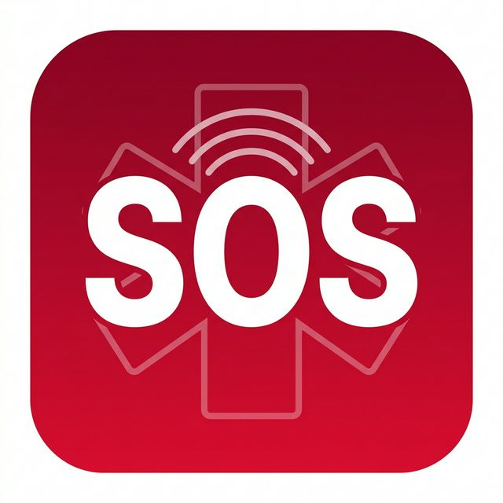
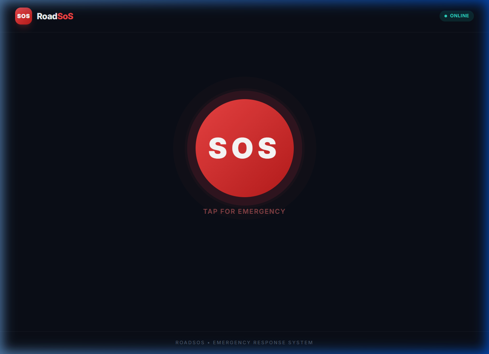
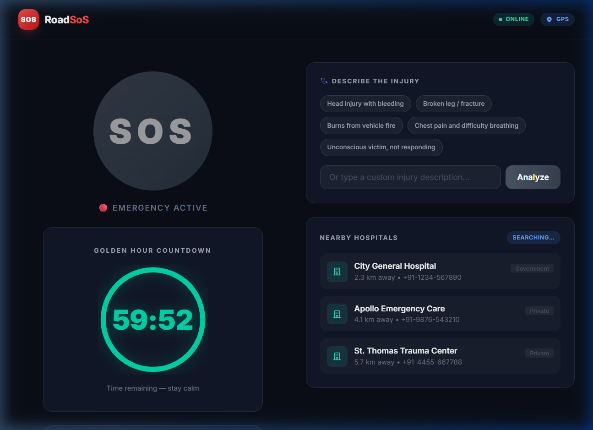
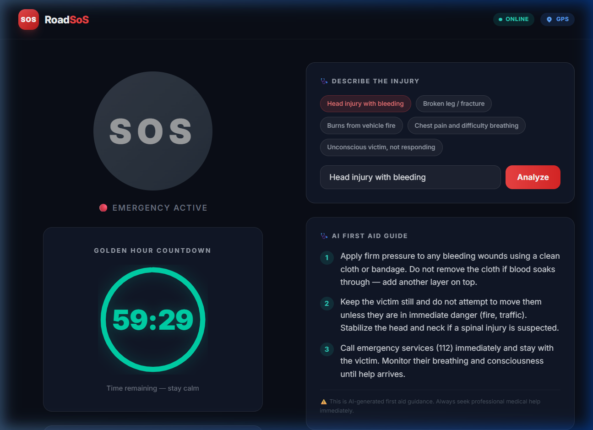

# 🚑 RoadSoS Vanguard



> **A fast, AI-powered emergency response system for road accidents that works offline and saves lives.**

## 📖 What is RoadSoS?

**RoadSoS** is a smart web application designed to help people during road accidents or medical emergencies. In high-pressure situations, people often panic and don't know what to do. RoadSoS solves this by providing:
- **Instant First-Aid Advice:** Powered by Google's Gemini AI, it tells you exactly what to do step-by-step.
- **Nearby Hospitals:** It automatically finds the closest hospitals based on your current location.
- **Offline Reliability:** If you lose internet connection, the app has a built-in offline mode with essential first-aid steps and fallback hospital data so you are never left helpless.
- **Crash Detection:** Uses your phone's sensors to detect sudden stops or impacts.

## ✨ Key Features (Explained Simply)

1. **🏥 Nearby Hospital Finder**
   - *What it does:* Uses your GPS location to find hospitals around you.
   - *How it works:* It talks to OpenStreetMap to get a list of nearby medical centers and shows you how far they are.

2. **🤖 AI Triage (Emergency Medical Assistant)**
   - *What it does:* You type what happened (e.g., "head injury, bleeding"), and it instantly gives you 3 simple, safe, and actionable first-aid steps.
   - *How it works:* It uses Google's Gemini AI under the hood. It even "streams" the words on your screen so you don't have to wait for the whole answer to load.

3. **📶 Works Offline (Zero-Cloud Fallback)**
   - *What it does:* If you are on a highway with no signal, the app still works!
   - *How it works:* It saves crucial medical advice and a backup list of hospitals on your phone so you can access them anywhere.

4. **📱 Emergency Medical ID (QR Code)**
   - *What it does:* Creates a QR code with your blood type and allergies. First responders can scan it to know your medical history instantly.

## 📸 Screenshots

| Landing Page | Emergency Dashboard | AI Triage Result |
| :---: | :---: | :---: |
|  |  |  |

## 🚀 How to Run the App (Getting Started)

Running RoadSoS is easy. It has two parts: the **Frontend** (what you see) and the **Backend** (the brain).

### Prerequisites
Make sure you have installed:
- [Node.js](https://nodejs.org/) (for the frontend)
- [Python 3](https://www.python.org/) (for the backend)

### 1. Start the Backend (The Brain)
Open a terminal and follow these steps:
```bash
# Go to the backend folder
cd backend

# Install the required Python packages
pip install -r requirements.txt

# Create a .env file and add your Gemini AI Key (Get one from Google AI Studio)
# Example: GEMINI_API_KEY="your_api_key_here"
cp .env.example .env 

# Start the backend server
uvicorn main:app --reload
```
*The backend will now run on `http://localhost:8000`.*

### 2. Start the Frontend (The App)
Open a **new** terminal and follow these steps:
```bash
# Go to the frontend folder
cd frontend

# Install the required Node packages
npm install

# Start the frontend app
npm run dev
```
*The app will now open in your browser at `http://localhost:5173`.*

## 🛠️ Technology Stack

- **Frontend:** React.js, Vite, Tailwind CSS (Styled for a modern, premium look)
- **Backend:** Python, FastAPI (Super fast and lightweight)
- **AI Engine:** Google Gemini 2.5 Flash
- **Maps / Location:** OpenStreetMap (Overpass API)
- **PWA (Progressive Web App):** Allows you to install the app on your phone's home screen.

---
*Built with ❤️ for the AI Road Safety Hackathon.*
